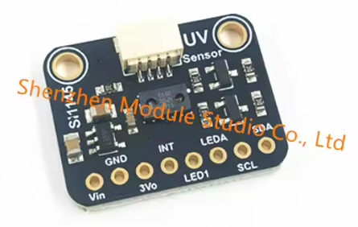
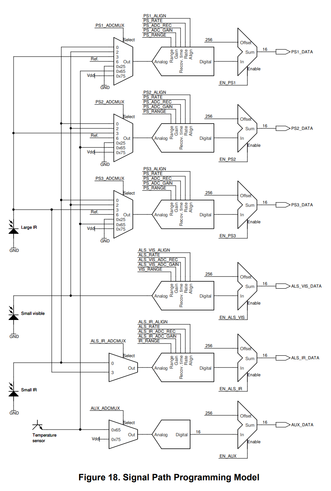

# Si114xSensor : Arduino Library for Si1145/6/7 
ALS, IR and Proximity/Motion/Gesture Sensor, with on-chip UV Index calculation.

> [!NOTE]
> The Silicon Labs Si144x chips are now discontinued (not manufactured). They do not contain a UV Sensor, the UV Index is estimated.

But you can still buy breakout boards like this one on AliExpress, from Shenzhen Module Studio Ltd (CHF 14.-) \
https://de.aliexpress.com/item/1005012309826317.html




The Silicon Labs data sheet says, "Integrated UV index sensor". That is not quite true. It estimates the UV Index from the ambient light and infrared sensor readings.

I updated this old code for the Arduino architecture while playing with UV Sensors. Maybe someone is interested. 

Below are some technical details, so read the Data Sheet first to get an overview. Page numbers, e.g. p28, refer to this version 1.3 (12/14) of the data sheet. \
https://www.waveshare.com/w/upload/9/99/Si1145-46-47.pdf

ALS = Ambient Light Sensor : ALS_VIS = Visible Light, ALS_IR = Infrared
PS = Position Sensor

## Advantages of this Antique Library

Unlike most of the other old Si114x libraries, this code adjusted the raw measurements using the gain, range setting and 16/17 bit alignment, see `getNormalisedMeasurements()`. Thus the LUX and other calculations automatically adapted according to the configuration, and the `automaticGainControl()` feature used normalized measurements and the correct max levels (0x3FFF or 0x7FFF depending on the 16/17 bit encoding, see below). 

It was also non-blocking, polling the `IRQ_STATUS` register or INT pin to determine when readings were ready, instead of waiting in a delay loop.

## 16 or 17-Bit Encoding

The ADC is 17-bits, but the measurement registers only hold 16-bits. So it must be configured to copy either the MS or the LS 16 bits from the ADC into the measurement registers, using the `PS_ENCODING` and `AS_ENCODING` parameters. 

The default is **MS 16 bits**. This means that the raw values should all be multiplied by 2 (shift left 1). This setting must be taken into account when using the raw measurements.

## Postion Sensing

This library does not handle proximity, motion or gesture sensing. Only the ambient light, IR sensor and UV Index are enabled. If you want to add proximity sensing, Silicon Labs has example code for full gesture sensing in this file, \
https://github.com/x893/SX1231/blob/master/SX12xxDrivers-2.0.0/src/platform/efm32libs/kits/common/drivers/si114x_algorithm.c

The Si1145 supports one IR LED for proximity only. If it's only proximity sensing that you need, use a cheap IR reflective sensor like the TCRT5000, \
https://muman.ch/muman/index.htm?muman-infrared-reflective-sensor.htm

For motion detection you'll need an Si1146 (with 2 x IR LEDs), and for gesture detection you'll need an Si1147 (with 3 x IR LEDS). But there are more recent and better chips out there for this, even using radar signals (mmWave radar sensors). There will be a muman.ch blog post about these soon.

## Input Selection and Configuration

Here is the diagram from the data sheet. Each ADC conversion has a multiplexer (MX) to select the input, configurable ADC conversion, and finally a Sum operation wch adds an offset of 256 to the reading. The AUX_ADCMUX at he bootom has no configuration, and only the VDD and Temperature inputs can be selected - or the AUX data registers are used for the UV Index value (not shown on the diagram). 




## AUX MUX

As seen above, the chip contains 5 multiplexers (MUX) which define the ADC inputs for each reading. The input for each MUX is selected with the `xxx_ADCMUX` parameters. Each has parameters for defining 16/17 bit alignment, rate, gain and range. But the AUX input does not have these.

The AUX input does not have an `xxx_ENCODING` setting, so it's not clear if it's the MS 16 bits or the LS 16 bits. I assume it is a full 16 bit reading.

The AUX MUX reading is normally used for the UV Index calculation, with readings in the the `AUX_DATAx_UVINDEXx` registers. Select this with `EN_UV` in `CHLIST`. Alternatively, AUX can be used for TEMPERATURE or VDD_VOLTAGE measuerment, p28. But the AUX reading seems to be scaled differently to 
the others. 

For example, with TEMPERATURE connected to PS1, PS2 or PS3 I got a reading of 0x429E (for example). When TEMPERATURE is connected to AUX then I got a reading of 0x2C3C. I was not able to find a relationship between these values.

`VDD_VOLTAGE` did not seem to work on the `PSx_ADCMUXs`, it always returns 0xFFFF, so I was not able to compare the VDD readings via the PSx and AUX ADCs.

## Overflow Detection

If a command is sent, the `RESPONSE` register can return an overflow status. This register is also used for command counting, which causes problems with the software because the command counter is not returned if an overflow occurs - so did the command work or not?

The library latches the overflow error into the `overflowError` value which is read and cleared with `getOverflowError()`. However, this only detects overflow if commands are being sent, so you should always check the returned values for 0xFFFF to detect overflow.

The max. value before overflow is returned is NOT 0xFFFE as you would imagine. This is not clearly described in the data sheet, and several of the libraries get this wrong.

The range is 0..0x3FFF for MS 16 bits or 0..0x7FFF for LS 16 bits, see the `PS_ENCODING` and `ALS_ENCODING` parameters.

For MS 16 bits, the result is set to 0xFFFF if above **0x3FFF**. For LS 16 bits, the result is set to 0xFFFF if above **0x7FFF**.

The 16/17 bit setting must be taking into accunt when doing automatic gain control.

## Grey Areas

There were a lot of unanswered questions with this chip. For example, go to p51 (AREA51). Nothing to do with "The Grays".

I never figured out what to do with the offset measurements (No Photodiode, GND measurement, VDD voltage, etc), despite playing around for a while. So I just ignored them, as did everyone else, including SiliconLabs. If anyone knows how to use these offset measurements, please let me know.

From the data sheet, p51...

**0x02: Visible Photodiode** \
A separate 'No Photodiode' measurement should be subtracted from this reading. Note that the result is a negative value. The result should therefore be negated to arrive at the Ambient Visible Light reading.

**0x03: Large IR Photodiode** \
A separate 'No Photodiode' measurement should be subtracted to arrive at Ambient IR reading.

**0x00: Small IR Photodiode** \
A separate 'No Photodiode' measurement should be subtracted to arrive at Ambient IR reading.

**0x06: No Photodiode** \
This is typically used as reference for reading ambient IR or visible light.

**0x25: GND voltage** \
This is typically used as the reference for electrical measurements.

**0x65: Temperature** \
(Should be used only for relative temperature measurement. Absolute temperature not guaranteed) A separate GND measurement should be subtracted from this reading.

**0x75: VDD voltage** \
A separate GND measurement is needed to make the measurement meaningful.


# Class Reference

```cpp
class Si114xSensor
{
public:
	// Override this is a derived class to code your own configuration
	virtual bool configureChip();

	bool begin(TwoWire* twoWire);
	bool writeDefaultConfiguration();
	bool softwareReset();
	bool writeConfiguration(const Si114x_CONFIG* config, uint configLength);

	bool forceMeasurement(bool als = true, bool ps = true);
	bool pauseMeasurements(bool als = true, bool ps = true);
	bool startMeasurements(bool als = true, bool ps = true);

	bool readAllMeasurements(Si114x_MEASUREMENTS* measurements);
	bool readAlsVis(uint* alsVis);
	bool readAlsIr(uint* alsIr);
	bool readPs1(uint* ps1);
	bool readPs2(uint* ps2);
	bool readPs3(uint* ps3);
	bool readUvIndex(uint* uvIndex);
	bool readTemperature(uint* temperature);

	bool writeIRQEnable(byte irqEnable);
	bool readIRQStatus(byte* irqStatus);
	bool readChipStatus(bool* running, bool* sleeping, bool* suspended);

	bool getNormalisedMeasurements(uint alsVis, uint alsIr,	ulong* normalisedVis,
		ulong* normalisedIr, byte relativeGain = 0);
	ulong calculateLux(uint alsVis, uint alsIr);
	bool automaticGainControl(uint aslVis, uint alsIr);
	void getGain(byte* visGain, byte* irGain, bool* visHighRange, bool* irHighRange);
};
```

## Overriding `configureChip()` for Custom Configuration

To avoid modifying the library file and provide a kind of configuration template, a class can be derived from Si114xSensor, and the `configureChip()` method can be overridden in the derived class. 

This is shown in the example sketch.


## Data Sheets

All page numbers refer to this version of the data sheet (Rev. 1.3 12/14) \
https://www.waveshare.com/w/upload/9/99/Si1145-46-47.pdf

An older version (Rev. 1.1 12/13) \
https://www.mouser.com/datasheet/2/737/Si1145-46-47-932790.pdf

**AN498: Si114x Designers Guide** \
for proximity and gesture detection \
https://www.silabs.com/documents/public/application-notes/AN498.pdf

**AN523: Overlay Considerations for theE Si114x Sensor** \
https://www.silabs.com/documents/public/application-notes/AN523.pdf

**AN580: Infrared Gesture Sensing** \
https://www.edn.com/eeweb-content/wp-content/uploads/articles-app-notes-files-infrared-sensing-1319238328.pdf

**AN522: Using the Si1141 for Touchless Lavatory Appliances** \
Thankfully, I couldn't find this one.


## Useful Code

SILICON LABS CODE (2014)
Look for Si114x
https://github.com/x893/SX1231/tree/master/SX12xxDrivers-2.0.0/src/platform/efm32libs/kits/common/drivers


BREAKOUT BOARDS

probably no longer available
https://github.com/Seeed-Studio/Grove_Sunlight_Sensor
https://learn.adafruit.com/assets/15517

OLD LIBRARIES
These don't handle changes in the configuration very well, and the don't 
seem to handle the 16/17 bit alignment.
https://github.com/adafruit/Adafruit_SI1145_Library
https://github.com/wollewald/SI1145_WE/tree/master
https://github.com/HGrabas/SI1145/tree/master


## Revision History

| Date  | Revision | Description |
|:---------- |:---------|:----------- |
| 2026.10.09 | 0.0.0	| Preiminary |

<br/>

## Joke of the Week


